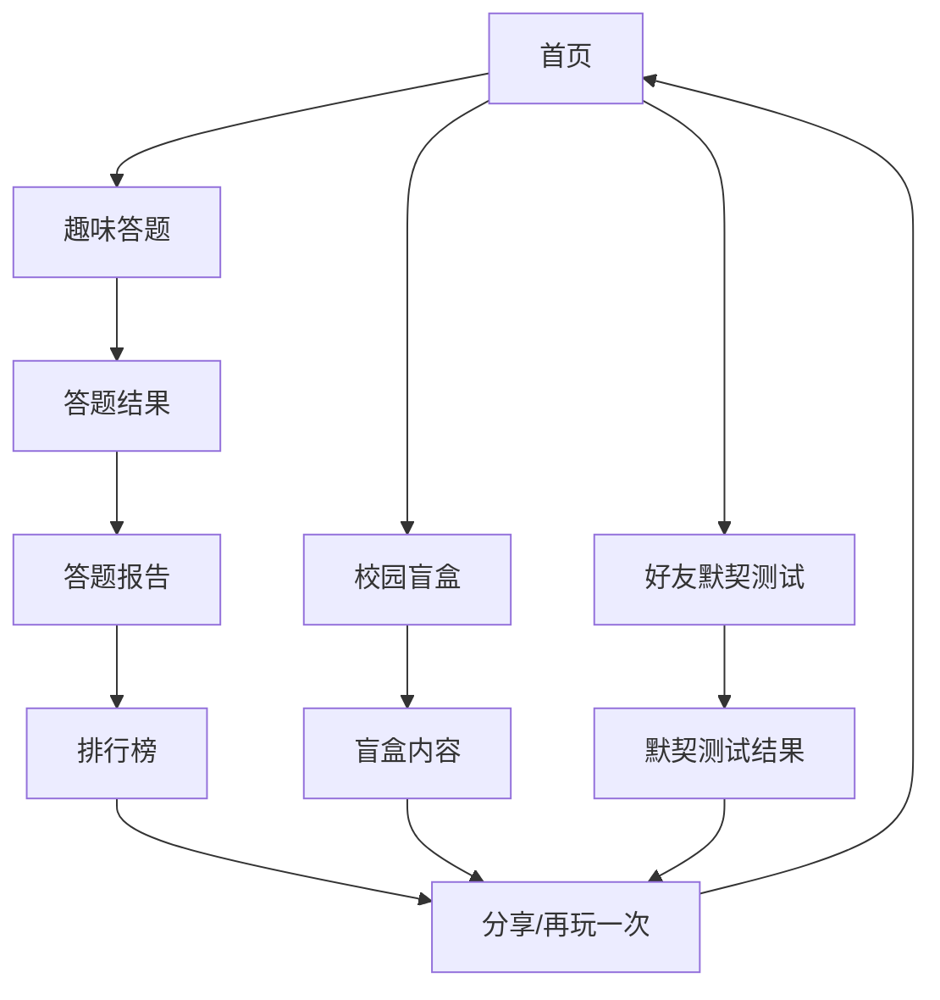

## 1. Product Overview
校园趣味互动网站 - 专为大学生打造的轻量化、高趣味性互动平台，提供趣味答题、校园盲盒、好友默契测试等轻松娱乐功能，帮助大学生在繁忙学业中放松身心、增进友谊。

## 2. Core Features

### 2.1 User Roles
| Role | Registration Method | Core Permissions |
|------|---------------------|------------------|
| 普通用户 | 无需注册，临时昵称登录 | 使用所有趣味功能，保存历史记录（本地存储） |

### 2.2 Feature Module
1. **首页**：功能入口导航、趣味欢迎动画、校园热点话题展示
2. **趣味答题**：多种题目类型、随机出题、即时反馈、答题积分、排行榜、答题报告
3. **校园盲盒**：随机抽取趣味内容、收藏功能、分享机制、积分兑换
4. **好友默契测试**：创建测试问卷、邀请好友参与、结果对比分析

### 2.3 Page Details
| Page Name | Module Name | Feature description |
|-----------|-------------|---------------------|
| 首页 | Hero 区域 | 动态欢迎语、可爱动画角色、今日幸运值展示 |
| 首页 | 功能导航 | 卡片式功能入口、悬停动效、点击反馈 |
| 趣味答题 | 题目展示 | 随机出题、计时器、选项高亮、进度条 |
| 趣味答题 | 结果反馈 | 正确/错误提示、知识点讲解、得分统计、积分奖励 |
| 趣味答题 | 排行榜 | 按积分排名、显示前50名、实时更新、分享按钮 |
| 趣味答题 | 答题报告 | 正确率、用时、击败人数、专属评语 |
| 校园盲盒 | 盲盒展示 | 3D旋转效果、点击开启动画、积分消耗提示 |
| 校园盲盒 | 内容展示 | 趣味内容、收藏功能、再开一个按钮、分享至社交平台 |
| 校园盲盒 | 收藏夹 | 已收藏内容列表、删除功能 |
| 好友默契测试 | 创建测试 | 自定义题目、设置答案、生成分享链接 |
| 好友默契测试 | 参与测试 | 填写问卷、即时提交 |
| 好友默契测试 | 结果对比 | 默契度百分比、详细分析图表、趣味评语 |

## 3. Core Process
用户进入网站 → 选择趣味功能 → 享受互动体验 → 查看/分享结果 → 探索更多功能

## 4. User Interface Design
### 4.1 Design Style
- 主色调：明亮橙色 (#FF6B35) 搭配天蓝色 (#4ECDC4)
- 辅助色：柠檬黄 (#FFE66D)、珊瑚粉 (#FF6B81)
- 按钮风格：圆润立体按钮、悬浮有弹跳效果、点击有缩放反馈
- 字体：展示字体使用 Fredoka One，正文字体使用 Noto Sans SC
- 布局风格：卡片式布局、圆角设计、大量留白、不对称构图
- 图标/emoji风格：emoji为主、配合手绘风格SVG图标、色彩鲜艳活泼

### 4.2 Page Design Overview
| Page Name | Module Name | UI Elements |
|-----------|-------------|-------------|
| 首页 | Hero 区域 | 渐变背景、弹跳动画元素、粒子效果、今日幸运值仪表盘 |
| 首页 | 功能导航 | 彩色卡片、emoji图标、悬停上浮效果、微动画 |
| 趣味答题 | 题目展示 | 卡片容器、动态倒计时、选项高亮效果、进度条、积分显示 |
| 趣味答题 | 结果反馈 | 庆祝动画、分数展示、知识点卡片、分享按钮、积分奖励提示 |
| 趣味答题 | 排行榜 | 排名列表、积分展示、实时更新动画、分享功能 |
| 趣味答题 | 答题报告 | 详细数据卡片、图表展示、趣味评语、分享按钮 |
| 校园盲盒 | 盲盒展示 | 3D旋转效果、神秘光芒、开箱动画、彩带效果、积分消耗提示 |
| 校园盲盒 | 内容展示 | 惊喜卡片、emoji装饰、收藏按钮、再开一个选项、社交平台分享按钮 |
| 好友默契测试 | 创建测试 | 表单卡片、拖拽排序、实时预览、生成链接按钮 |
| 好友默契测试 | 结果对比 | 默契度圆环图、对比列表、趣味评语卡片、分享功能 |

### 4.3 Responsiveness
桌面端优先设计，移动端自适应，触摸友好，所有交互元素尺寸适合手指点击，布局在小屏幕上自动堆叠。

### 4.4 趣味创意亮点
1. **今日幸运值**：首页展示随机生成的幸运值，搭配对应的幸运emoji和趣味文案
2. **盲盒开箱动画**：点击盲盒时有3D旋转、光芒四射、彩带飘落的庆祝效果
3. **答题反馈**：答对有烟花效果，答错有可爱的鼓励动画
4. **默契度展示**：使用动态圆环图展示默契度，百分比数字从0滚动到最终值
5. **微交互细节**：按钮悬停有弹跳效果，卡片有轻微浮动，滚动时有视差效果
6. **积分系统**：答题获得积分，积分可用于开启盲盒，增强用户粘性
7. **排行榜系统**：实时更新的积分排行榜，激发用户竞争意识
8. **答题报告**：详细的答题数据分析，提供个性化反馈